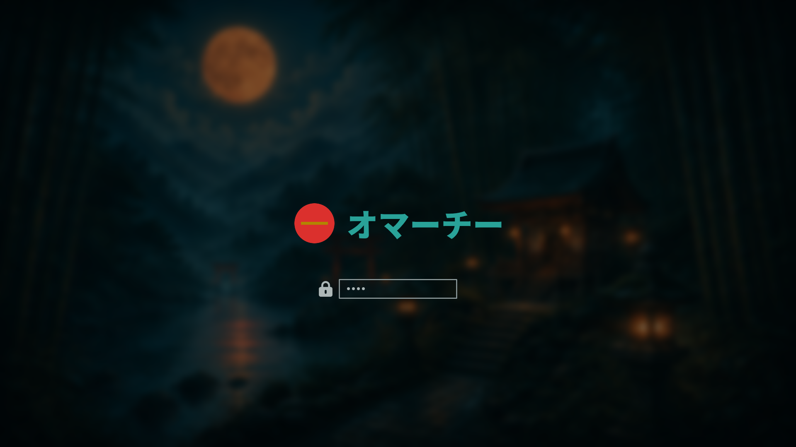
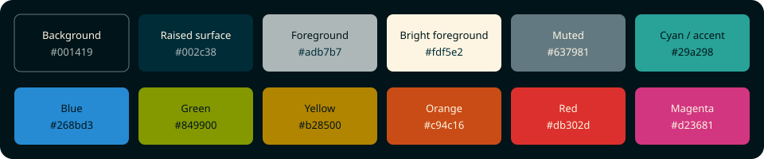

# Solarized Japan for Omarchy

An unofficial Omarchy theme combining a dark Japanese-inspired desktop with
the palette of [Solarized Osaka](https://github.com/craftzdog/solarized-osaka.nvim).




## Features

- Solarized Osaka palette adapted to Omarchy 4 semantic color roles
- High-contrast terminal selections, suggestions, and readable foregrounds
- Nine original Japanese-inspired wallpapers, including a wordmark wallpaper
- `Yaru-sage` file-manager icons
- Japanese Plymouth unlock mark displaying `オマーチー`
- Blurred shrine-and-bamboo unlock preview with warm antique-gold lighting
- Generated terminal, shell, editor, browser, and system-tool themes through
  Omarchy's `colors.toml` templates

## Installation

From the Omarchy menu, open **Install > Style > Theme** and paste:

```text
https://github.com/R7rainz/omarchy-solarized-japan.git
```

Or install from a terminal:

```bash
omarchy theme install https://github.com/R7rainz/omarchy-solarized-japan.git
```

Apply the theme manually with:

```bash
omarchy theme set solarized-japan
```

## Wallpaper and unlock controls

Cycle wallpapers with:

```bash
omarchy theme bg next
```

The unlock artwork appears under **Style > Unlock**. `unlock.png` is the
transparent Plymouth mark; `preview-unlock.png` is the selector preview.

### Blurred SDDM unlock screen

`preview-unlock.png` is a static selector/README preview. The normal Omarchy 4
theme interface applies `unlock.png` and palette colors to the system SDDM
theme, but it does not copy a theme wallpaper into SDDM or load a theme-owned
`Main.qml` file. Therefore a blurred preview does not automatically make the
real SDDM unlock screen blurred.

This repository includes `sddm-background.png`, the same fixed pre-blurred
artwork used behind the logo in `preview-unlock.png`. It is deliberately a
separate SDDM asset and never follows the user's selected desktop wallpaper.

To add the effect locally, install the included image as `background.png` in
the root-owned SDDM theme directory:

```bash
sudo install -o root -g root -m 0644 sddm-background.png \
  /usr/share/sddm/themes/omarchy/background.png
```

Back up the SDDM layout before editing it:

```bash
sudo cp -a /usr/share/sddm/themes/omarchy/Main.qml \
  /usr/share/sddm/themes/omarchy/Main.qml.solarized-japan.bak
sudoedit /usr/share/sddm/themes/omarchy/Main.qml
```

Place this before the existing `Connections` and login `Column` blocks so the
login UI remains above the background:

```qml
Image {
  anchors.fill: parent
  source: "background.png"
  fillMode: Image.PreserveAspectCrop
  smooth: true
}

Rectangle {
  anchors.fill: parent
  color: "#001419"
  opacity: 0.30
}
```

Use the fixed `sddm-background.png` from this repository; do not point the
QML at `~/.config/omarchy/current/background`, or the SDDM image will change
with the desktop wallpaper. Reapply the image and QML edit after running an
Omarchy Plymouth/SDDM refresh or applying a system update, because those
commands rebuild the root-owned SDDM theme. This is an optional machine-local
customization, not an automatically applied part of the portable theme format.

## Palette



| Role | Color |
| --- | --- |
| Background | `#001419` |
| Raised surface | `#002c38` |
| Foreground | `#adb7b7` |
| Bright foreground | `#fdf5e2` |
| Muted | `#637981` |
| Cyan / accent | `#29a298` |
| Blue | `#268bd3` |
| Green | `#849900` |
| Antique gold | `#c4a15a` |
| Orange | `#c94c16` |
| Red | `#db302d` |
| Magenta | `#d23681` |

The palette starts from Solarized Osaka. Foreground, selection, and
antique-gold roles are tuned for Omarchy readability.

## Theme layout

```text
solarized-japan/
├── backgrounds/                 # selectable wallpapers
│   ├── background1.jpg ... background6.jpg
│   ├── background7.png          # wordmark wallpaper
│   ├── background8.jpg          # minimalist dark Japanese garden wallpaper
│   └── background9.jpg          # lighter twilight valley wallpaper
├── colors.toml                  # palette source of truth
├── icons.theme                  # Yaru-sage
├── preview.png                  # theme-selector preview
├── unlock.png                   # transparent Plymouth mark
├── preview-unlock.png           # unlock-selector preview
├── sddm-background.png          # fixed blurred SDDM artwork
├── palette.svg                  # documented palette preview
├── theme.yaml                   # repository/gallery metadata
├── LICENSE
├── NOTICE
└── README.md
```

`theme.yaml` is repository metadata for gallery/submission tooling; Omarchy's
runtime theme source remains `colors.toml`.

## Credits and licensing

- [Takuya Matsuyama / craftzdog (Devaslife)](https://github.com/craftzdog)
  for [Solarized Osaka](https://github.com/craftzdog/solarized-osaka.nvim)
- [Ethan Schoonover](https://ethanschoonover.com/solarized/) for the original
  Solarized color scheme
- [Omarchy](https://omarchy.org/) for the desktop environment and theming
  tooling

Theme configuration, documentation, palette artwork, and project-created
wallpaper/unlock artwork are provided under the [Apache License 2.0](LICENSE),
subject to the third-party attribution and trademark notes in [NOTICE](NOTICE).

This project is independent and is not officially affiliated with Omarchy,
Solarized Osaka, Devaslife, or Ethan Schoonover.

## Contributing

Issues and pull requests are welcome. Please include the wallpaper/artwork
source or permission details when contributing new visual assets.
